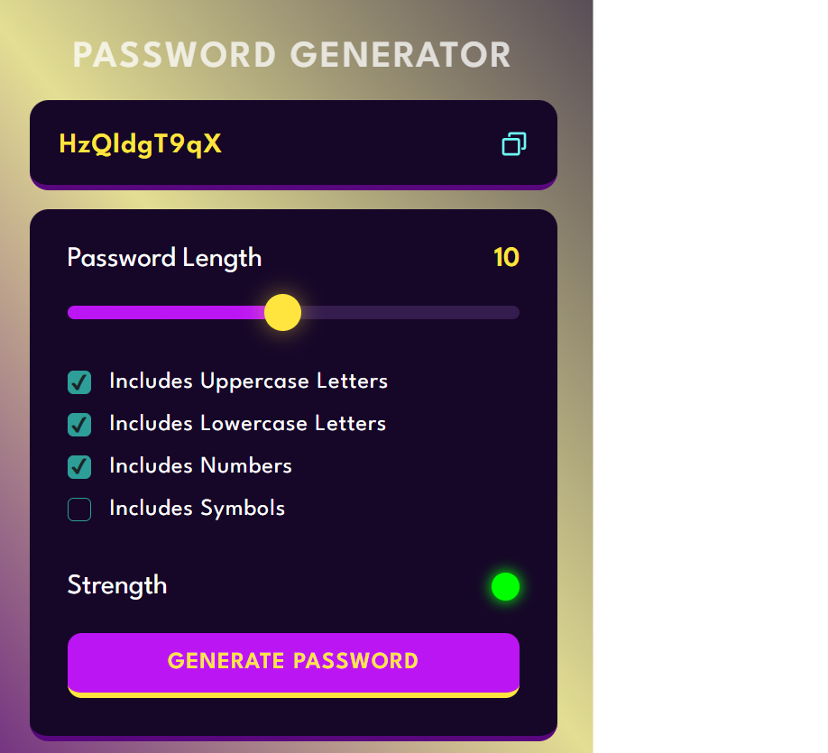

# 🔐 Random Password Generator

Welcome to the Random Password Generator project! This tool helps you generate secure passwords with just a few clicks. It's built with JavaScript, HTML, and CSS, and features an intuitive interface to help you create strong passwords.

## 🎥 Live Demo

Check out the live demo of this password generator ['here'](https://random-password-generator-lilac.vercel.app/).




## ✨ Features

- **Password Strength Indicator:** Shows the strength of your password as you include different character types.
  - 🟢 Strong (includes uppercase, lowercase, numbers, and symbols)
  - 🟡 Medium (includes uppercase, lowercase, and numbers)
  - 🔴 Weak (includes only uppercase and lowercase)
- **Customizable Length:** Choose the length of your password.
- **Copy to Clipboard:** Easily copy your generated password using the copy icon.

## Technologies Used  
  

  


## 🚀 Getting Started

Ready to generate some strong passwords? Follow these steps to get a local copy up and running.

### 📦 Installation

1. **Clone the Repository:**

   ```bash
   git clone https://github.com/sumitch76/Random-password-generator.git

 2. **Navigate to the Project Directory:**
   ```
     cd Random-password-generator
   ```

   
